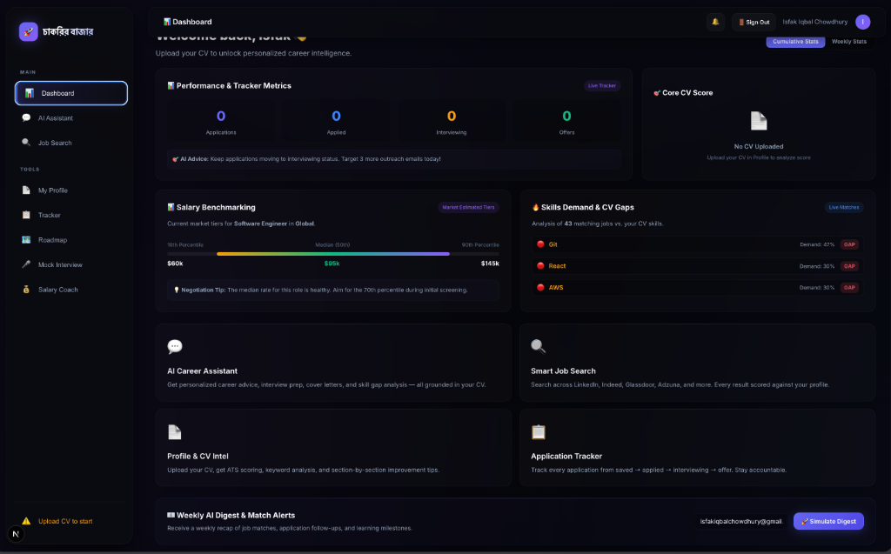

# চাকরির বাজার (Chakrir Bazar) 🚀

> **Your Agentic Career Co-pilot.** Hunts live jobs across 7 platforms, scores your fit against your actual CV, drafts cover letters, builds personalized learning roadmaps, and tracks every application — all in one place.

**Built for Codesprint 2026 | Powered by Poridhi.io**

[](https://nextjs.org)
[](https://aistudio.google.com)
[](https://typescriptlang.org)
[](LICENSE)

---

## 🎨 Visual Showcase



---

## 💡 What It Does

চাকরির বাজার (Chakrir Bazar) solves the fragmented job-seeking experience with four fully integrated pillars:

| Pillar | What it does |
|---|---|
| 🔍 **Job Hunter Agent** | Natural language search across 7 live platforms, every result scored against your CV |
| 📄 **CV Intelligence** | Upload your CV → section-chunked → TF-IDF RAG → AI improvement analysis |
| 💬 **AI Assistant** | Gemini-powered chat that knows your background before you say a word |
| 📋 **Progress Tracker** | Kanban board, monthly calendar, goals, roadmap progress, streak counter |

---

## 🚀 Quick Start

### 1. Clone and install

```bash
git clone https://github.com/IsTu25/JobSearch.git
cd JobSearch
npm install
```

### 2. Configure environment

```bash
cp .env.example .env.local
```

Open `.env.local` and fill in your API keys (see table below).

> [!IMPORTANT]
> Make sure to specify your `GEMINI_API_KEY` and `SERPER_API_KEY` for job fetching and AI analysis to work. Other keys are optional fallbacks.

### 3. Run locally

```bash
npm run dev
```

Open [http://localhost:3000](http://localhost:3000)

---

## 🔑 API Keys

| Variable | Required | Source | Free Tier |
|---|---|---|---|
| `GEMINI_API_KEY` | ✅ Yes | [aistudio.google.com](https://aistudio.google.com/app/apikey) | ✅ Yes |
| `SERPER_API_KEY` | ✅ Yes | [serper.dev](https://serper.dev) | ✅ 2,500 searches/month |
| `ADZUNA_APP_ID` | Recommended | [developer.adzuna.com](https://developer.adzuna.com) | ✅ Yes |
| `ADZUNA_APP_KEY` | Recommended | [developer.adzuna.com](https://developer.adzuna.com) | ✅ Yes |
| `REED_API_KEY` | Optional | [reed.co.uk/developers](https://www.reed.co.uk/developers/jobseeker) | ✅ Yes |
| `UPWORK_ACCESS_TOKEN` | Optional | [developers.upwork.com](https://developers.upwork.com) | Requires approval |

> [!TIP]
> Remotive, Jobicy, and The Muse are free open APIs and require no keys! If optional keys are missing, the agent skips them gracefully without throwing errors.

---

## ✨ Features

### 🔍 Pillar 1 — Job Hunter Agent
- **Natural Language Search** — Ask queries like `"Find me ML internships in Dhaka open this month"`. চাকরির বাজার (Chakrir Bazar) uses Gemini 2.5 Flash on the backend to parse the query into structured parameters.
- **7 Live Sources In Parallel** — Serper (Google Jobs/LinkedIn/Indeed), Adzuna, Remotive, Jobicy, The Muse, Reed.co.uk, Upwork.
- **Programmatic Fit Scoring** — Weighted 4-component calculation:
  $$\text{Fit Score} = (\text{Skills} \times 0.45) + (\text{Experience} \times 0.30) + (\text{Education} \times 0.15) + (\text{Location} \times 0.10)$$
- **Explainable Match Reasons** — Shows exactly which skills you match and where your gaps are.
- **One-Click Tracking** — Instantly push any search result into your Kanban board.

### 📄 Pillar 2 — CV Intelligence (RAG Core)
- **Multi-Format Upload** — Drag and drop PDF, DOCX, or TXT.
- **Hierarchical Section Chunking** — Partitions CVs into Summary, Experience, Education, Skills, Projects, and Certifications.
- **TF-IDF Semantic Embeddings** — Performs client-side sparse term embedding and cosine similarity queries to feed the AI context.
- **AI Improvement Audit** — Evaluates Content Clarity, Keyword Optimization, Quantified Impact, Formatting, and Completeness, returning specific rewrite suggestions.

### 💬 Pillar 3 — AI Assistant
- **Context-Grounded Chat** — RAG automatically pulls the top 3 relevant chunks from your CV to ground chat responses, preventing hallucinations.
- **Readiness Verdicts** — Instantly answers questions like `"Am I ready for this Data Engineer role?"` or `"Draft a cover letter for this job posting"`.
- **Markdown & Code Support** — Clean formatting for code blocks, tables, and comparison grids.

### 📋 Pillar 4 — Productivity & Progress Tracker
- **Kanban Board** — Visual columns: Saved → Applied → Interviewing → Offer → Rejected with drag-and-drop state updates.
- **Inline Card Notes** — Edit application notes directly on cards to save interview details.
- **Interactive Roadmaps** — Generates monthly learning roadmap checklists. Checkboxes dynamically calculate the completeness percentage.
- **Proactive AI Nudges** — Alerts you when you go inactive and recommends top matched jobs based on fit scores.

---

## 🏗️ Architecture

```
┌────────────────────────────────────────────────────────┐
│              User (Browser — React 19)                  │
│  Dashboard │ AI Chat │ Job Search │ Tracker │ Roadmap  │
└─────────────────────────┬──────────────────────────────┘
                          │ HTTPS
                          ▼
┌────────────────────────────────────────────────────────┐
│          Next.js 16 — Serverless API Routes            │
│                                                        │
│  /api/parse-cv      — PDF/DOCX/TXT → chunks + TF-IDF  │
│  /api/chat          — RAG retrieval + Gemini chat      │
│  /api/jobs          — NLP parse + 7-source aggregation │
│  /api/analyze-cv    — AI CV review (strengths/gaps)    │
│  /api/generate-roadmap — Structured learning plan      │
└──────┬──────────────────┬──────────────────────────────┘
       │                  │
       ▼                  ▼
  Google Gemini      Job APIs (7 sources)
  2.5 Flash          Serper, Adzuna, Remotive,
                     Jobicy, The Muse, Reed, Upwork
```

> [!NOTE]
> Read **[SYSTEM_DESIGN.md](./SYSTEM_DESIGN.md)** for database schemas, pgvector scaling strategies, Upstash Redis caching, and cost models.

---

## 📂 Project Structure

```
JobSearch/
├── src/
│   ├── app/
│   │   ├── api/
│   │   │   ├── analyze-cv/route.ts      # AI CV review
│   │   │   ├── chat/route.ts            # RAG + Gemini chat
│   │   │   ├── generate-roadmap/route.ts # AI roadmap builder
│   │   │   ├── jobs/route.ts            # 7-source job aggregator
│   │   │   └── parse-cv/route.ts        # CV parser + TF-IDF
│   │   ├── globals.css                  # Design system (dark glassmorphism)
│   │   ├── layout.tsx
│   │   └── page.tsx                     # App entry point
│   ├── components/
│   │   ├── ChatView.tsx                 # AI assistant UI
│   │   ├── Dashboard.tsx                # Stats + nudges + quick actions
│   │   ├── JobSearch.tsx                # Job search + result cards
│   │   ├── ProfileView.tsx              # CV upload + scoring + AI improvement
│   │   ├── RoadmapView.tsx              # AI roadmap + progress tracking
│   │   ├── Sidebar.tsx                  # Navigation (desktop + mobile drawer)
│   │   └── TrackerView.tsx              # Kanban + goals + calendar + heatmap
│   └── lib/
│       ├── prompts.ts                   # System prompt + CV context builder
│       ├── store.tsx                    # React Context + reducer + localStorage
│       ├── tfidf.ts                     # TF-IDF vectorizer + cosine similarity
│       └── types.ts                     # All TypeScript interfaces
├── .env.example                         # Environment variable template
├── EVALUATION_SUITE.md                  # 10 test cases with logs
├── SYSTEM_DESIGN.md                     # Architecture + scaling + cost model
├── AGENTS.md                            # AI agent rules
└── README.md
```

---

## 🛠️ Tech Stack

| Layer | Technology |
|---|---|
| **Framework** | Next.js 16 (App Router, TypeScript) |
| **AI / LLM** | Google Gemini 2.5 Flash |
| **RAG Engine** | Custom TF-IDF (client-side vectors) |
| **Job APIs** | Serper, Adzuna, Remotive, Jobicy, The Muse, Reed, Upwork |
| **CV Parsing** | pdf-parse, mammoth |
| **State** | React Context + localStorage |
| **Markdown** | React-Markdown + Remark-GFM |
| **Styling** | Vanilla CSS (Dark Glassmorphism UI) |

---

## 🧪 Testing

See **[EVALUATION_SUITE.md](./EVALUATION_SUITE.md)** for detailed logs of the 14 test cases covering all feature paths.

---

## 📄 License

MIT
