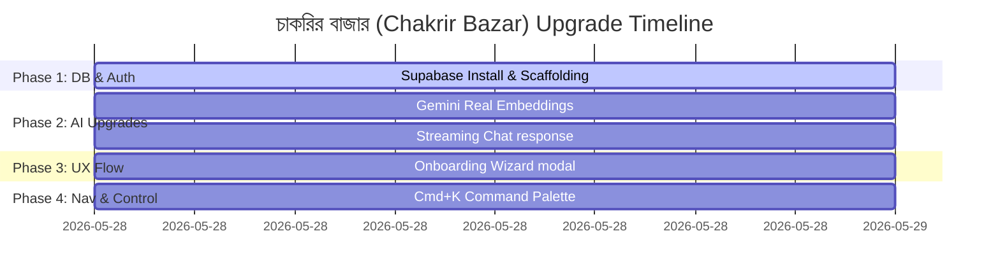

# চাকরির বাজার (Chakrir Bazar) 🚀 Upgrade Implementation Plan

Track progress through the 10/10 feature enhancement roadmap.

---

## Progress Dashboard

---

## Roadmap Checklist

### Phase 1 — Supabase Setup & Scaffolding
- [x] Install Supabase npm packages (`@supabase/supabase-js`, `@supabase/auth-helpers-nextjs`)
- [x] Create `supabase_schema.sql` containing initial migrations (pgvector, tables, RLS policies)
- [x] Create `src/lib/supabase.ts` for database client initialisation
- [x] Set up environment variable placeholders in `.env.example` and `.env.local`

### Phase 2 — AI Upgrades (Embeddings & Streaming Chat)
- [x] Implement Gemini `text-embedding-004` in `/api/parse-cv/route.ts` (replace TF-IDF vectors)
- [x] Update `/api/chat/route.ts` to compute cosine similarity using real vector arrays
- [x] Implement Server-Sent Response Streaming in `/api/chat/route.ts` using `chat.sendMessageStream`
- [x] Update `src/lib/store.tsx` to handle streaming message mutations (e.g. `UPDATE_LAST_MESSAGE` reducer)
- [x] Overhaul `ChatView.tsx` to consume the Response reader stream chunk-by-chunk in real-time

### Phase 3 — Onboarding Wizard
- [x] Build `src/components/Onboarding.tsx` with a multi-step workflow (Welcome/Upload → Preferences → Start)
- [x] Integrate local storage state to track onboarding completion status
- [x] Add the onboarding workflow into the main layout `src/app/page.tsx`

### Phase 4 — Command Palette (Cmd+K)
- [x] Create `src/components/CommandPalette.tsx` with overlay layout and keyboard hook (`Cmd+K` / `Ctrl+K`)
- [x] Wire up command palette shortcuts (navigate tabs, trigger job matches, prompt presets)
- [x] Register command palette in `src/app/page.tsx`
